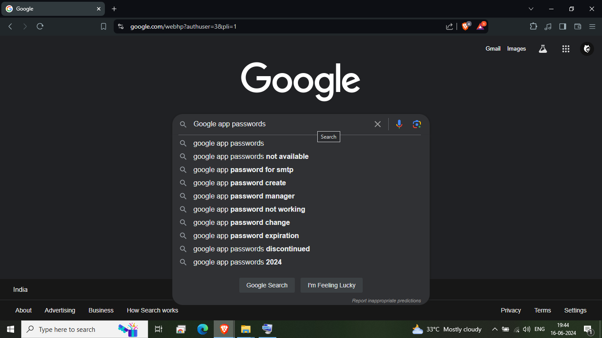
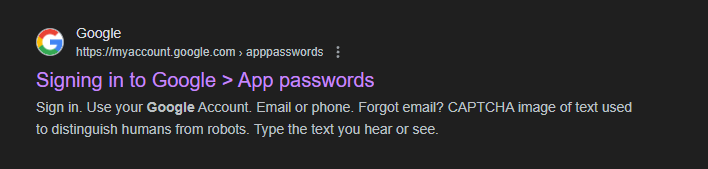
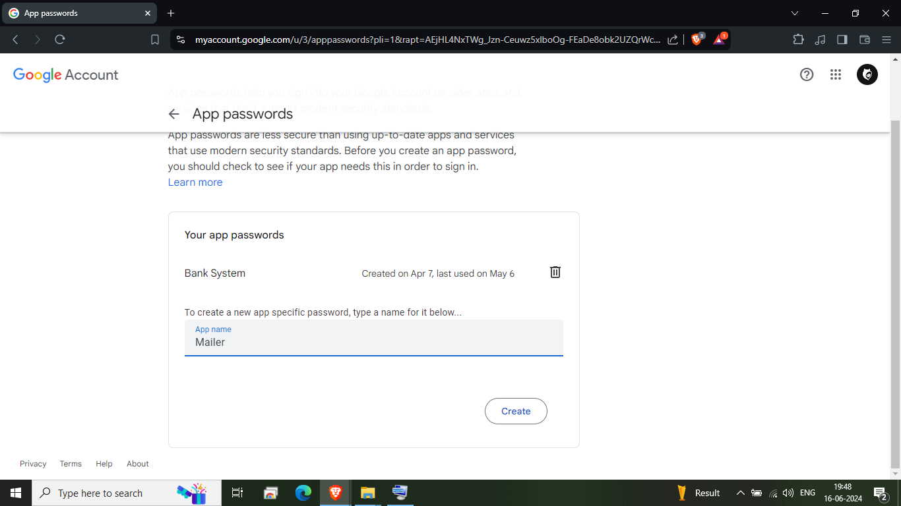
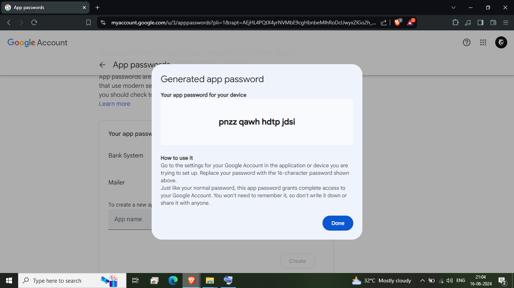
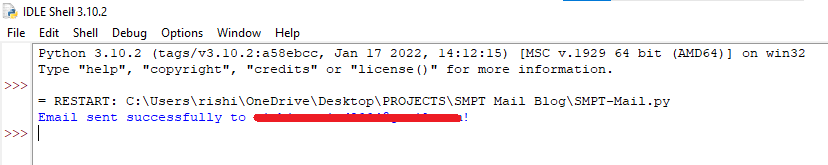
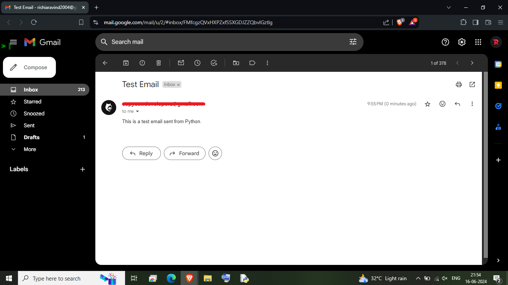

# SMTP-Mailer
An way to send automated mail to person using python language!


# How to get Gmail App Password?
Follow the below shot steps to get app password

> [!CAUTION] 
> Make sure you gmail has 2-step verification enabled!, from avoiding other miss using your mail!(You can able to generate app password only if your 2-step verification enabled and activated)

**Step 1:** Login the sender's gmail on your one of the browser


**Step 2:** Search as "Google app passwords"



**Step 3:** Vite your google accounts app passwords line



**Step 4:** Generate your app password
Fill the app's name and hit create to generate app password



**Step 5:** Now you got your new app's password 


# How to run in Python?

First of all install required package by executing following command in command prompt.

```pip install smtplib```

Replace "your_email@gmail.com" and "your_app_password" with your actual sender gmail and app's password

```
Sender_Email = "your_email@gmail.com"
App_password = "your_app_password"
```
And cases of sending emails and replace your "Recipient_Emails" , "Subject" and content of your mail.


```
    #In case, if your sending mail for single person means create an string variable like below

    Recipient_Emails = "recipient1_email@gmail.com"

    #In other case, if you want to send mail to more the one person means create a variable as list like #below

    Recipient_Emails = ["recipient1_email@gmail.com", "recipient2_email@gmail.com"]
```

Subject and Content

```
Subject = "Test Email"
Content = "This is a test email sent from Python."
```

And Finally run your code the email has been sent to Recipient Emails through the code!

After Execution



